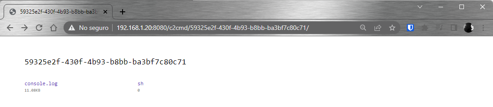

# Segunda evaluación - Técnicas de Evasión de Sistemas de Seguridad y Creación de Malware - Mayo 2022

### Introducción

Este proyecto es parte de una evaluación del Diplomado de Red Team de la Universidad de Santiago de Chile, y consiste en una aplicación que se ejecute en un cliente, que primero suba información a un servidor, y permita la ejecución de comandos remotos.   Se solicita que las piezas se desarrollen en GO y que al ejecutarse en ambiente Windows no sea bloqueado por el antivirus.


&nbsp;


### Diseño

El repositorio esta organizado de la siguiente forma:
- **README.md**: El presente archivo
- **app/**: Se mantendrán los archivos específicos de la aplicación que se ejecutará en el cliente
- **build.sh**: Script bash que compila el código del servidor y del cliente, para Linux, Windows y Mac.
- **config/**: Archivos relacionados con la configuración.   Dado que el servidor se ejecuta en ambiente seguro, se usa un archivo json externo, pero para el cliente se usa una versión codificada del mismo archivo, en la misma carpeta se encuentra un script que obfusca el contenido del archivo server.json.
- **libs/**: Archivos de soporte con código compartido entre las aplicaciones cliente y servidor.
- **res/**: Recursos relacionados con la documentación.
- **webserver/**: Archivos específicos relacionados al servidor web.


**Arquitectónicamente**, la solución planteada es bastante simple, hay un servidor web que constantemente publica información con la dirección donde éste se encuentra a la escucha, y que espera conexiones de las aplicaciones clientes, los cuales al iniciar buscan información sobre los servidores disponibles, se conectan a uno de éstos y suben información relacionada al host en el cual se está ejecutando, y permanece solicitando comandos para ejecutar.


&nbsp;

### Servidor Web

El servidor web está basado en [Echo](https://echo.labstack.com/), y al iniciarse lee el archivo json de configuración, desde donde obtiene los datos de un servidos externo donde publicará la información que los clientes utilizarán para localizarlo, y a continuación se inicia la escucha de peticiones web de los clientes.


Cuando un nuevo cliente se conecta con el servidor, comienza a realizar peticiones GET a distintas rutas, enviando en las cabeceras información relacionada a las características del host, por ejemplo la ruta GET:/images/i/ho.png se utiliza para subir el archivo host_info.json, que contiene información relacionada al cliente que se acaba de conectar:


Después de eso el cliente se mantiene consultando una ruta a través de la cual se puede enviar comandos al cliente.


&nbsp;

### Cliente

La aplicación de cara al usuario sólo despliega una barra de progreso que al llegar al 99% muestra un mensaje de error y vuelve a comenzar.


Aunque si se ejecuta la aplicación con la variable de entorno DEBUG con valor 1, el cliente mostrará información relacionada a la comunicación con el servidor:


Como se puede apreciar en la imagen, la aplicación en segundo plano recoge información de la máquina donde se está ejecutando, enviando ésta información al servidor.   La información está empaquetada en archivos JSON, cuyo contenido viaja en la petición web, obfuscada y codificada en base 64, entre los Headers.   Por ejemplo a continuación se puede ver uno de los archivos que muestra información específica del host en el que se ejecuta:

```json
{
  "hostname": "DESKTOP-4LG4SGB",
  "uptime": 2622,
  "bootTime": 1652981182,
  "procs": 130,
  "os": "windows",
  "platform": "Microsoft Windows 10 Enterprise Evaluation",
  "platformFamily": "Standalone Workstation",
  "platformVersion": "10.0.19044 Build 19044",
  "kernelVersion": "10.0.19044 Build 19044",
  "kernelArch": "x86_64",
  "virtualizationSystem": "",
  "virtualizationRole": "",
  "hostId": "8f4fda03-3322-43b7-b311-573c2f502899"
}
```

Esta información se obtiene usando la librería [gopsutil](https://github.com/shirou/gopsutil), que funciona sin problemas en clientes Linux, Windows o Macs.

A continuación dejo ejemplos de los archivos que el cliente envía al servidor:
- [CPU](res/json/cpus.json)
- [Memoria](res/json/host_info.json)
- [Información del Host](res/json/hosts_ips.json)
- [Ips](res/json/memory.json)
- [Interfaces de Red](res/json/network_interfaces.json)
- [Particiones](res/json/partitions.json)
- [Uso de los discos](res/json/partitions_usage.json)

&nbsp;

### Command & Control

La finalidad del ejercicio era además generar una herramienta que permita enviar comandos al cliente y ejecutarlos de forma remota, sin que éste sea detectado por el antivirus.   Por lo que el cliente, despues de establecer una conexión inicial con el servidor permanece solicitando comandos a éste:


Cada nuevo cliente que se conecta es identificado por un GUID, y en el servidor son creadas multiples carpetas donde se encontrará la información de cada cliente, por ejemplo para un cliente que se identifica como *59325e2f-430f-4b93-b8bb-ba3bf7c80c71*, se crearán en la ruta donde se ejecuta el servidor web, las carpetas **wr/hosts/59325e2f-430f-4b93-b8bb-ba3bf7c80c71** y **wr/c2cmd/59325e2f-430f-4b93-b8bb-ba3bf7c80c71**, donde se encontrarán los archivos relacionados a la información del host y los de command&control respectivamente.   Estos archivos se encontrarán disponibles a travéz del servidor web.




La carpeta c2cmd del cliente contiene un archivo donde se encontrará el historial de comandos ejecutados remotamente y sus respuestas:


Y en la misma carpeta se encontrará un segundo archivo que indicará cual es el interprete que se utilizará en el cliente, éste archivo se crea en cuanto el cliente envía información respecto al host.   En Linux se utilizará sh, para Windows será powershell y para Mac zsh.

Para ejecutar un nuevo comando, en la misma carpeta c2cmd donde se encuentran los archivos, se debe crear un nuevo archivo llamado "command" con el comando que se ejecutará en el cliente, éste permanecerá en el disco hasta que el cliente realice una solicitud de comandos, en éste momento el servidor web detectará este archivo, leerá el contenido, y lo borrará.   Los comandos serán obfuscados para ser enviados al cliente, este los desobfuscará y ejecutará.   Una vez que se ha ejecutado el comando, el cliente realizará una nueva petición GET al servidor, con una URL específica donde enviará también obfuscada la respuesta, que será registrada por el servidor.

Por ejemplo en la imagen siguiente se puede ver que se crea el archivo "command" con el comando "Get-Process", mientras el cliente **0fa7ce78-ac0b-44e6-a0a5-81ed850c08a5** se encuentra activo:


Y una vez que el cliente ejecuta el comando, el historial mantendrá el comando y su respuesta:


Un resultado similar se puede ver cuando se ejecuta el siguiente comando en un cliente Mac:


&nbsp;
